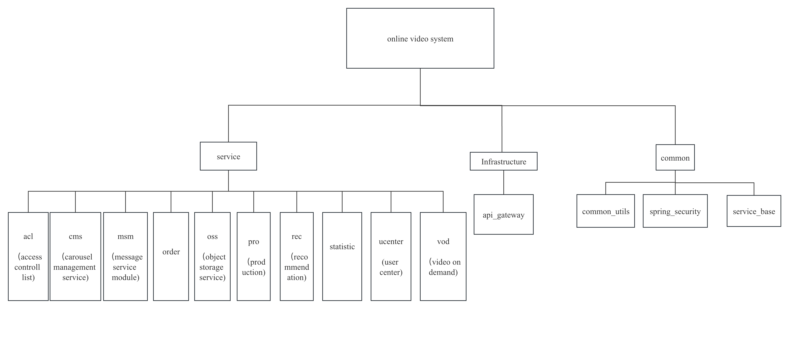

# ONLINE VIDEO SYSTEM

[Instruction on how to deploy the project(blog on my github.io)](https://jas000n.github.io/jekyll/2023-08-30-Deploy-Online-Video-System.html)

## 0. INTRODUCTION

Design and implementation of a movie viewing and recommendation system based on Spring Cloud and Vue. This system aims to: 
* provide users with a convenient and diverse viewing platform for film and TV shows, 
* make intelligent recommendations based on user preferences to enhance users' viewing experience,
* provide a background management site to administrators with convenient and easy-to-use background management tool

**Innovative aspects**:
* 943 Uses & 1682 Movies in the system, with 100k interaction records, enabled by MovieLens dataset
* Nuxt server side rendering, improved search engine optimization (SEO) and faster initial page load times
* Features to improve user experience: Line Chart for Statistics, Redis for index page data cache, WeChat Login......
* ......

## 1. TECHLOGOLIES USED

In order to meet the technical requirements, I have chosen some common technologies and tools. 

First, I use AliCloud's Video-on-Demand (VOD) service to store and read videos. With this service, the site can support multiple video formats and encodings, and provide fast uploading and acceleration services to meet the different needs of online video applications. 

In addition, I use MyBatisPlus as the persistence layer framework to improve development efficiency and code quality by utilizing the features and tools it provides, such as automatic code generation, generic CRUD operations, paging queries, performance analysis, etc. 

In order to achieve video classification management, I used the Java tool EasyExcel, which can easily realize the import and export functions of Excel files. 

I use Alibaba Cloud Object Storage (OSS) to store data such as user avatars, video covers, etc., and use Spring Boot's OSS SDK to implement service calls.

In order to test the functionality and performance of the backend interface, I used postman for interface testing. Postman can send HTTP requests, test the function and performance of the backend interface, and debug and monitor the interface. By setting information such as request header, request body, and request parameters, the interface can be fully tested.

In terms of front-end development, I chose the Vue.js-based component library element UI to develop the front-end of the website and the back-end interface of the webmaster. element UI provides a series of beautiful, easy-to-use, and efficient UI components to meet the needs of different interfaces. 

In addition, in order to facilitate users to edit video introduction, I integrated the TinyMCE rich text editor, allowing users to edit rich text content in a visual way.

For the requirements of the recommendation system, I chose the MovieLens 100k dataset as the basic data, and imported it into my viewing system after processing, and registered accounts for 943 users, and 1600 movies were written into the database. A total of about 100,000 pieces of data. I use a collaborative filtering algorithm to recommend videos for users, and use Flask as the server backend, and register with Nacos for remote calls by other microservices.

In order to ensure the security of the system, I use Spring Security as a security framework to assign roles and permissions to background managers. The security part of the system is completed in the form of five classic tables of users, roles, permissions and their relationships.

In order to verify the registered mobile phone number, I use the Alibaba Cloud SMS service to send a SMS verification code and store it in Redis to verify the user's mobile phone number.

In order to realize the payment function, I use the WeChat payment developer interface, and users can purchase favorite film and television works through WeChat payment. Registering as a WeChat developer is more complicated, but I used the ID and Key for learning to simulate the payment function.

In order to improve user experience and website performance, I use Nuxt as a Vue.js-based server-side rendering framework to package Vue.js applications into static HTML files that can run on the server. This results in faster page loads and is good for search engine optimization.

In terms of video play, I chose Alibaba Cloud Video Player as a player developed based on HTML5 technology. It supports video file playback in multiple formats, and has the characteristics of clear and smooth, fast loading and customizable skins. It is suitable for various Online video application scenarios.

In order to improve the performance of the front page of the website and reduce queries to MySQL, I used Redis as a cache database to store information such as home page data and SMS verification codes.

In order to realize the WeChat login function, I adopted the OAuth2.0 protocol provided by the WeChat open platform. Users can use the WeChat account to quickly log in to the system, eliminating the cumbersome registration process and improving the security and credibility of the account. This is widely used in various mobile and web applications.

Finally, in order to facilitate system deployment and management, I chose Ubuntu as the operating system, and used IDEA and WebStorm as development tools to improve development efficiency and code quality. As a relational database management system, MySQL is used to store related data of the system.

All in all, my final project is the design and implementation of a movie viewing and recommendation system based on Spring Cloud and Vue. By integrating multiple technologies and tools, including Alibaba Cloud VOD, MyBatisPlus, EasyExcel, Alibaba Cloud OSS, element UI, rich text editor, postman, recommendation system, Spring Security, Alibaba Cloud SMS, WeChat payment, Nuxt, Alibaba Cloud video playback Server, Redis, WeChat login, Nacos, Ubuntu, IDEA and WebStorm, etc., I built a movie viewing and recommendation system with complete functions, excellent performance, safety and reliability. All the codes of this project, including SQL scripts, various configuration files, etc., are open source at https://github.com/Jas000n/online_video_sys. Among more than 100 commits, each commit has a very detailed commit message, recorded The content of each submitted work. Guaranteed authenticity and originality of the project. 
